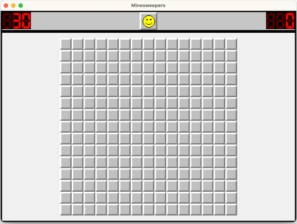

# Minesweeper in Compose Multiplatform

This is a Minesweepers implementation written using Kotlin Multiplatform and Compose Multiplatform for Android, Desktop and iOS(experimental). 

| Target  | Status                                                                                                                                                                               |
|---------|--------------------------------------------------------------------------------------------------------------------------------------------------------------------------------------|
| Android |  |
| Debian  |     |
| iOS     |              |
| Mac     |              |
| Windows |  |

This project was started by using the following resources as reference:
- [Compose Multiplatform Template](https://github.com/JetBrains/compose-multiplatform-template)
- [Compose Multiplatform](https://github.com/JetBrains/compose-multiplatform)

| Android                                     | Desktop                                     | iOS                                     |
|---------------------------------------------|---------------------------------------------|-----------------------------------------|
|  |  |  |

## Android
To run on Android, use the `androidApp` run configuration in [Android Studio](https://developer.android.com/studio)
or use Gradle:

`./gradlew installDebug` - install Android application on an Android device (on a real device or on an emulator)

## Desktop(Debian/Mac/Windows)
This template contains  `desktopApp` run configuration that you can use to run the desktop target in Android Studio or IntelliJ IDEA.

Useful Gradle tasks:
- `./gradlew run` - run application
- `./gradlew package` - package native distribution into `build/compose/binaries`

## iOS

Make sure you have set up your environment for mobile development with Kotlin Multiplatform. A detailed guide on how to set up your environment is available in the [Kotlin Multiplatform documentation](https://kotlinlang.org/docs/multiplatform-mobile-setup.html).

To work with the iOS target you need:
- A machine running a recent version of macOS
- [Xcode](https://developer.apple.com/xcode/) (to setup the environment)
- [Android Studio](https://developer.android.com/studio)
- [Kotlin Multiplatform Mobile plugin](https://plugins.jetbrains.com/plugin/14936-kotlin-multiplatform-mobile) (to work with all supported targets, including iOS)
- [CocoaPods](https://kotlinlang.org/docs/native-cocoapods.html)

**Before opening the project in Android Studio**, make sure that your environment is set up for iOS and Kotlin Multiplatform development.
Use [`kdoctor`](https://github.com/Kotlin/kdoctor) to ensure your development environment is configured correctly.

### Running on an iOS simulator

Once you have configured your environment correctly, you will be able to select which iOS simulator to run your application in Android Studio on by modifying the `iosApp` run configuration.

Select "Run" | "Edit Configurations..." and navigate to the "iOS Application" | "iosApp" run configuration. In the "Execution target" drop-down, select your target device.

### Running on a real iOS device

For instructions please refer to the [JetBrains instructions](https://github.com/JetBrains/compose-multiplatform-template#ios) in the template repo.
